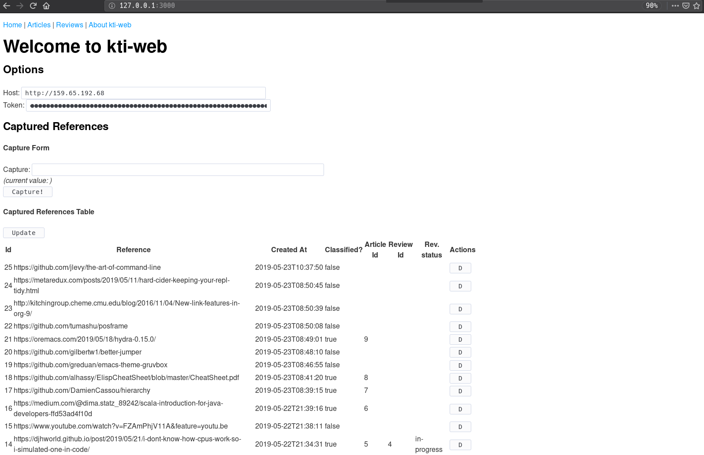

# kti-web

This is the kti-web project.

This is a personal project which is a frontend to https://github.com/vitorqb/kti.

## Installing

As simple as this:

```shell
curl -L -o kti-web.jar https://github.com/vitorqb/kti-web/releases/download/0.3.0/kti-web.jar && java -jar kti-web.jar
```

Then open your browser at `127.0.0.1:3000`.



## Host and Token

Notice you need to input a Host and a Token.

The host is the backend you will talk to. There is backend available at `http://159.65.192.68`.

The token can be requested to the backend with a post request:

```shell
curl -H 'Content-Type: application/json' --data '{"email": "<your-email>"}' 159.65.192.68/api/token
```

You will receive an email with the token.

## Minimum kti version
As of now the minimum version is 1.4.3.
https://github.com/vitorqb/kti/releases/tag/1.4.3

## Development mode

The project uses figwheel-main (https://github.com/bhauman/figwheel-main) for development builds.

To start the Figwheel compiler, navigate to the project folder and run the following command in the terminal:

```
lein run -m figwheel.main -b dev --repl
```

This runs the build in the `:dev` profile, starts a development server at http://localhost:9500, hot-reloads on changes and starts an interactive repl.

You can also use the main entrypoint for a development server without figwheel:

```
lein do clean, run
```

The application will now be available at [http://localhost:3000](http://localhost:3000).

For connecting to a standalone backend running locally inside a docker (good for development), see
[dockerfiles/kti/Readme.org](dockerfiles/kti/Readme.org)


### Optional development tools

Start the browser REPL:

```
$ lein repl
```
The Jetty server can be started by running:

```clojure
(start-server)
```
and stopped by running:
```clojure
(stop-server)
```

## Running the tests
To run [cljs.test](https://github.com/clojure/clojurescript/blob/master/src/main/cljs/cljs/test.cljs) tests, please use

```
lein doo
```

As of now we only test in firefox. Those depend on `karma karma-firefox-launcher karma-cljs-test`, which should be installed locally using npm.

Running this command at the project root should be enough:

```
npm install
```

## Building for release

```
lein do clean, uberjar
```

## Deploying to Heroku

Make sure you have [Git](http://git-scm.com/downloads) and [Heroku toolbelt](https://toolbelt.heroku.com/) installed, then simply follow the steps below.

Optionally, test that your application runs locally with foreman by running.

```
foreman start
```

Now, you can initialize your git repo and commit your application.

```
git init
git add .
git commit -m "init"
```
create your app on Heroku

```
heroku create
```

optionally, create a database for the application

```
heroku addons:add heroku-postgresql
```

The connection settings can be found at your [Heroku dashboard](https://dashboard.heroku.com/apps/) under the add-ons for the app.

deploy the application

```
git push heroku master
```

Your application should now be deployed to Heroku!
For further instructions see the [official documentation](https://devcenter.heroku.com/articles/clojure).
