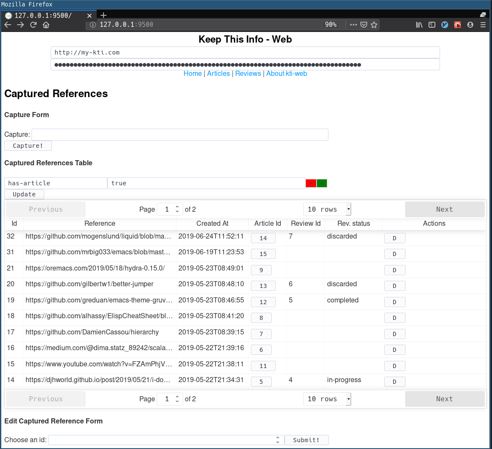

# kti-web

This is the kti-web project.

This is a personal project which is a frontend to https://github.com/vitorqb/kti.

## Installing

As simple as this:

```shell
curl -L -o kti-web.jar https://github.com/vitorqb/kti-web/releases/download/0.8.1/kti-web.jar && java -jar kti-web.jar
```

Then open your browser at `127.0.0.1:3000`.



## Host and Token

Notice you need to input a Host and a Token.

The host is the backend you will talk to. There is backend available at `http://159.65.192.68`.

The token can be requested to the backend with a post request:

```shell
curl -H 'Content-Type: application/json' --data '{"email": "<your-email>"}' 159.65.192.68/api/token
```

You will receive an email with the token.

## Minimum kti version
As of now the minimum version is 1.4.3.
https://github.com/vitorqb/kti/releases/tag/1.4.3

## Development tools

This project uses `cljs-shadow`. Make sure you have npm and yarn installed.

First, install npm dependencies using yarn:

```sh
yarn install
```

Then start the shadow-cljs server
```sh
npx shadow-cljs server

> [...]
> shadow-cljs - HTTP server available at http://localhost:9500
> shadow-cljs - server version: 2.8.40 running at http://localhost:9501
> shadow-cljs - nREPL server started on port 9502
```

And watch the `app` build.
```sh
npx shadow-cljs watch app

> shadow-cljs - connected to server
> shadow-cljs - watching build :app
> [:app] Configuring build.
> [:app] Compiling ...
> [...]
```

The application will now be available at [http://localhost:9500](http://localhost:9500).
The shadow-cljs server will be at [http://localhost:9501](http://localhost:9501).
The Nrepl server will be available at [http://localhost:9502](http://localhost:9502).

If you want to connect emacs + cider, I have the following in my .emacs
```emacs-lisp
;; Adds a type of cider cljs repl specifically for kti-web
(pushnew
 '(ktiweb
   "(do (require 'shadow.cljs.devtools.api) (shadow.cljs.devtools.api/repl :app))"
   cider-check-shadow-cljs-requirements)
 cider-cljs-repl-types)

(defun ktiweb-cider-connect-cljs ()
  "Connects cider to a running `shadow-cljs` nrepl server."
  (interactive)
  (-let [default-directory ${PATH_TO_REPO_ROOT}]
    (cider-connect-cljs
     '(:host "localhost"
       :port 9502
       :project-dir ${PATH_TO_REPO_ROOT}
       :cljs-repl-type ktiweb))))
```

You will probably want to setup a backend as well. For connecting to a
standalone backend running locally inside a docker (good for
development), see [dockerfiles/kti/Readme.org](dockerfiles/kti/Readme.org)


## Running the tests
There are two ways of running tests. The first is using the shadow-cljs built-in
reporter:

```sh
npx shadow-cljs watch test-browser

> shadow-cljs - config: /home/vitor/mygit/kti-web/shadow-cljs.edn  cli version: 2.8.40  node: v11.15.0
> shadow-cljs - connected to server
> shadow-cljs - watching build :test
> [:test] Configuring build.
> [:test] Compiling ...
> [...]
```

Then navigate to [http://localhost:9503](http://localhost:9503).

The second option is to run using karma.

First watch the test-karma build
```sh
npx shadow-cljs watch test-karma 
```

And now run karma
```sh
npx karma start
```

## Building for release

To compile just the js part:
```sh
./scripts/compile-js-for-release
```

To prepare a uberjar with a static file handler and the js:
```sh
./scripts/prepare-uberjar
```
